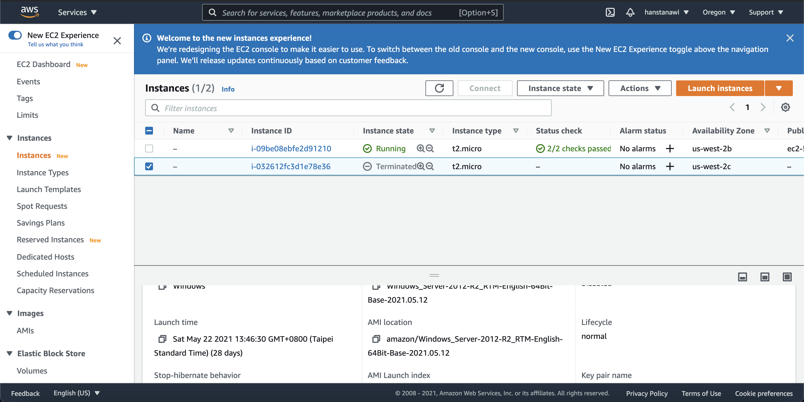
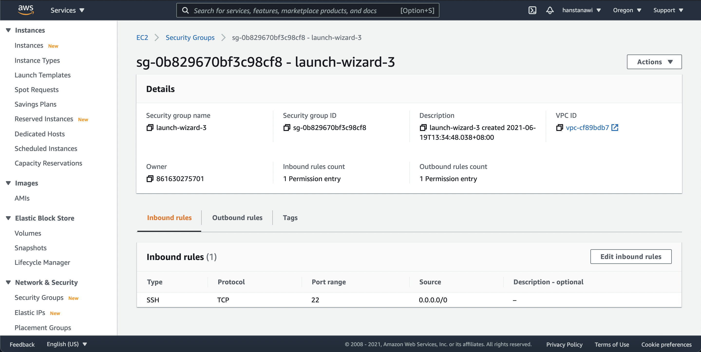

# Deploying with Amazon EC2

Steps

1. Create and launch EC2 instance, VPC and security group
2. Configure security group to expose all required ports to WWW
3. Connect to instance using SSH, install Docker and run container

### Creating EC2 Instance

1. **Visit Amazon Web Services (AWS) Management Console and select the EC2 service**

    

2. **Launch a new EC2 instance and select an Amazon Machine Image (AMI)**

    In this case we choose the Amazon Linux 2 AMI (HVM), SSD Volume Type (Free tier eligible)

    

3. Choose Instance Type (choose the free tier one) t2.micro

    

4. Make sure the VPC (Virtual Private Cloud) is selected. The default one is fine

    

5. Create a new key pair before launching. Download it and keep it somewhere safe. Don't share with anyone whom we don't want to give access to. This key pair allows you to connect to our EC2 instance. If we lose it, we need to create a new instance again.

    

6. Make sure the created instance is up and running

    

---

### Connecting to the EC2 Instance

Connect with SSH

Run this command, if necessary, to ensure your key is not publicly viewable

```bash
chmod 400 contact-keeper-server.cer
```

Connect to your instance using its Public DNS

```bash
ssh -i "contact-keeper-server.cer" ec2-user@ec2-54-212-4-186.us-west-2.compute.amazonaws.com
```


---

### Install Docker on the EC2 instance

To ensure all the essential packages on the instance are updated

```bash
sudo yum update -y
```

Run this to install Docker on the EC2 instance

```bash
sudo amazon-linux-extras install docker
```

The `amazon-linux-extras` command is available because we chose the Linux AMI for the instance environment.

After the installation is done run

```bash
sudo service docker start
```

This command allows Docker starts in the remote machine

Make sure that Docker is running on the remote machine by running  `docker run --help`


---

### Pushing Images to the EC2 Instance

There are two options to run the container on the remote machine

- Option 1: Deploy Source Code
    - Build image on remote machine
    - Push source code to remote machine, run `docker build` and then `docker run`
- Option 2: Deploy Built Image
    - Build image before deployment (e.g. on local machine)
    - Just execute `docker run`
    - We can use Docker Hub to push our image to and pull the image that is in Docker Hub from our EC2 instance and run the container there.
1. Create a new repository on Docker Hub

    

2. Build the image locally

    ```bash
    docker build -t contact-keeper-node:latest .
    ```

    Small note: make sure to add `--build linux/amd64` if we build the image using Mac M1 processor, so the EC2 instance can run it.

    Rename the image to match the repository name in Docker Hub

    ```bash
    docker tag contact-keeper-node hanstanawi/contact-keeper-backend:latestPush the local image to Docker hub
    ```

3. Push the local image to Docker hub

    Make sure we are logged in

    ```bash
    docker login
    ```

    Push the local image

    ```bash
    docker push hanstanawi/contact-keeper-backend:latest
    ```

4. Make sure the image is pushed successfully

    

---

### Running the Container on the EC2 Instance

1. Open the ssh tab in the terminal and run

    ```bash
    sudo docker run -d -p 5000:5000 --rm hanstanawi/contact-keeper-backend:latest
    ```

2. Configure security groups and expose all ports
    - Open Security Groups page

        

    - Edit Inbound Rule to allow HTTP request on the exposed port for the container

        

        Add a new rule with HTTP and edit the source to Anywhere

        

        Now try opening the IPv4 Public address and our API is deployed! 😁