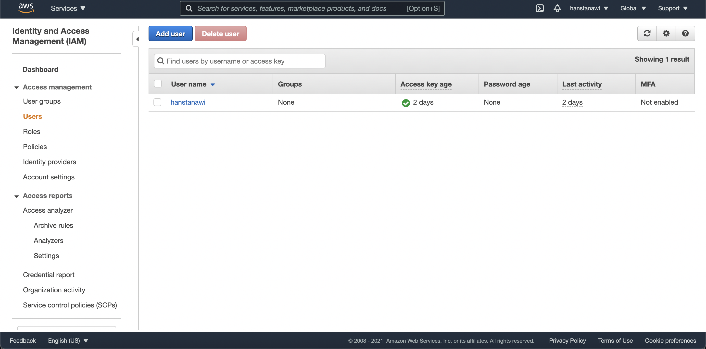
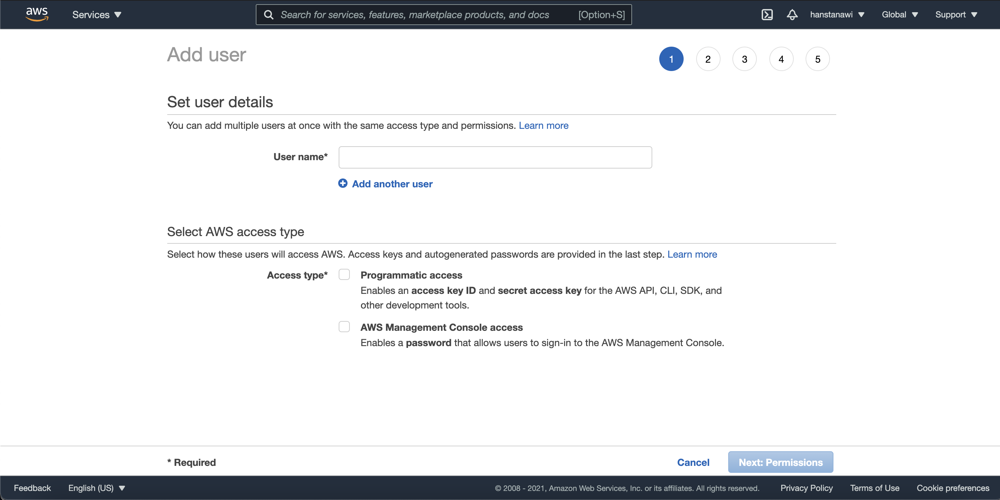
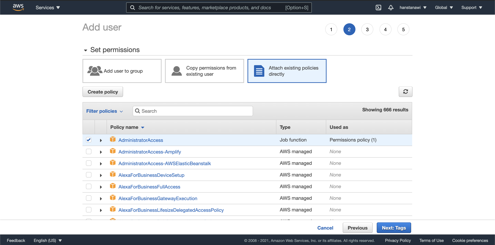
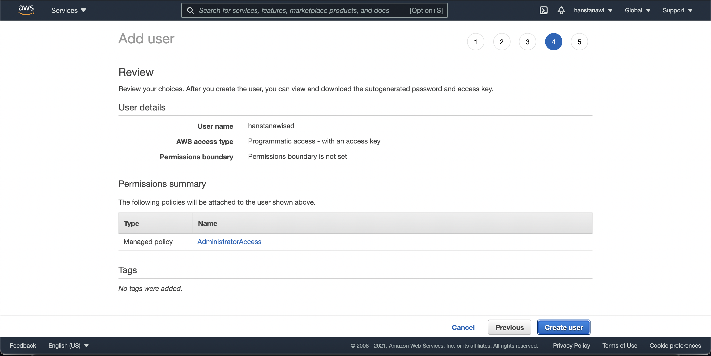
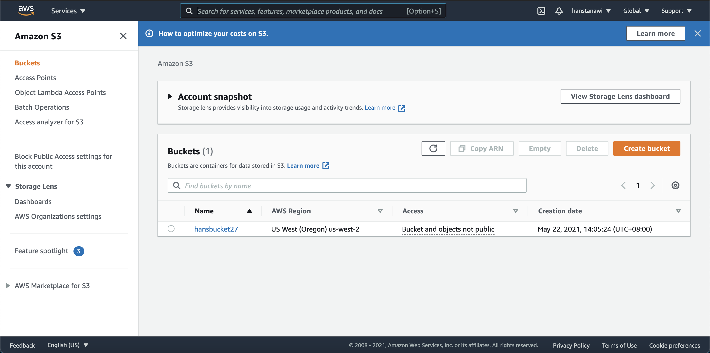
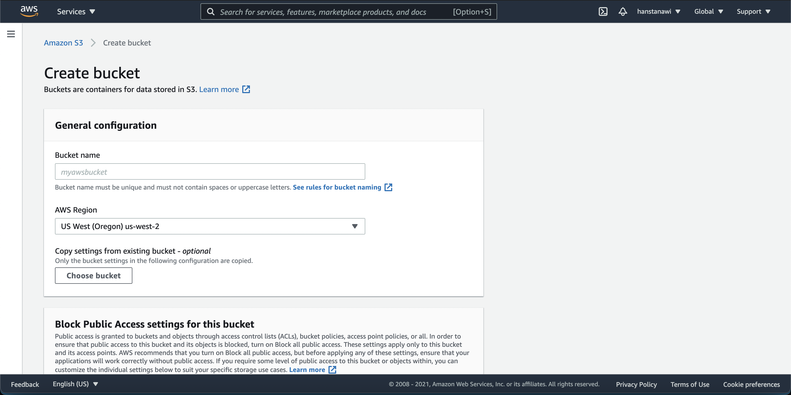
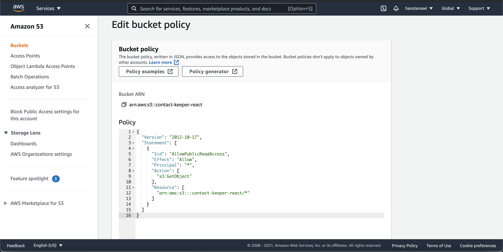
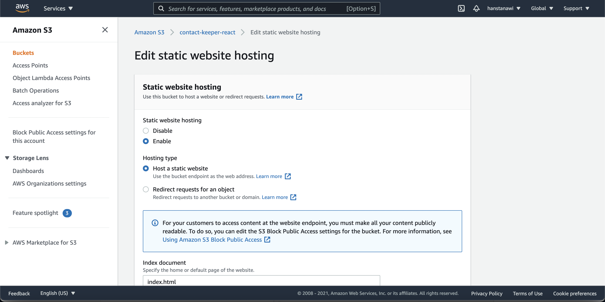
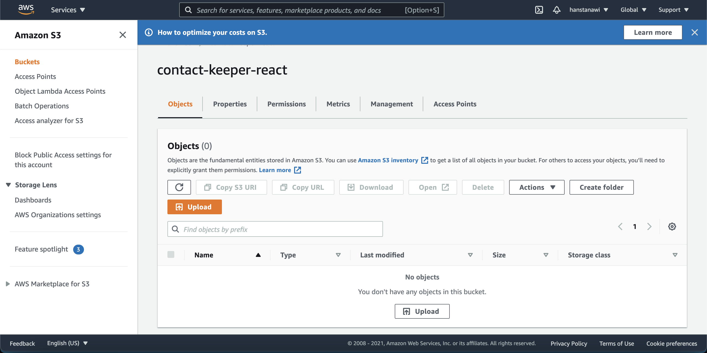
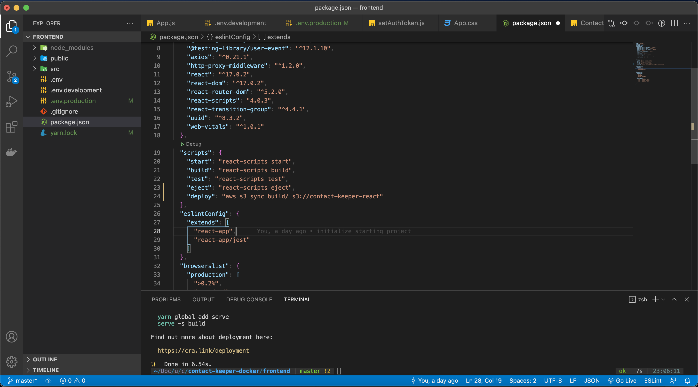

# Frontend Deployment with Amazon S3

### Steps

1. Run `npm run build` to build the React app as a production-ready app
2. Create an IAM User access for the AWS Management Console to allow deploying the static files from local machine to S3 bucket through AWS CLI
3. Create S3 Bucket instance
4. Run the command through AWS CLI to deploy it

### Build React App as Production Mode

1. Change the directory to `frontend`
2. Make sure that `npm` or `yarn` package manager is installed on our machine. Run `npm install` or `yarn` to install the dependencies.
3. Run `npm run build` to let React build our code as optimized files with static `index.html` file and compressed JavaScript files
4. This `build` folder is the one that we are going to deploy to the S3 bucket.

### Create IAM User Access

1. Go to AWS Management Console and search for IAM

    

2. Add User and add a username with programmatic access

    

3. Set permissions for the created user. Switch to the "Attach Existing Policies" directly tab and select `AdministratorAccess`.

    

4. Create user and download the `credentials.csv` to get the Access Key ID and AWS Secret Access Key to access our AWS Console through the AWS CLI

    

5. Install AWS CLI

    For mac

    ```bash
    brew install awscli
    ```

6. Once AWS CLI is installed, copy the following command passing in your Access Key ID and your Secret Access Key from `credentials.csv`

    ```bash
    aws configure
    AWS Access Key ID [None]: <ACCESS_KEY_ID>
    AWS Secret Access Key [None]: <SECRET_ACCESS_KEY>
    Default region name [None]: us-west-2
    Default output format [None]: ENTER
    ```

7. Now the AWS CLI is completely configured, we can create our S3 bucket

### Create S3 Bucket Instance

1. Open the Amazon S3 service page



2. Create a new bucket



3. Edit Bucket Policy to allow public access



4. Enable and Edit Static Web Hosting option for the bucket



5. Created the bucket



---

### Deploy the Built React App to S3

1. Add a `deploy` script in `package.json` in the frontend directory. This script allows us to directly copy our `build` to our S3 bucket.

    ```json
    "scripts": {
      "start": "react-scripts start",
      "build": "react-scripts build",
      "test": "react-scripts test",
      "eject": "react-scripts eject",
      "deploy": "aws s3 sync build/ s3://contact-keeper-react"
     }
    ```

2. Run the script, if we want, we can rebuild the app in case there are changes to the app.

    ```bash
    npm run build && npm run deploy
    ```


3. Now our app is deployed! We can open [http://contact-keeper-react.s3-website-us-west-2.amazonaws.com/](http://contact-keeper-react.s3-website-us-west-2.amazonaws.com/) to access and test the deployed app.